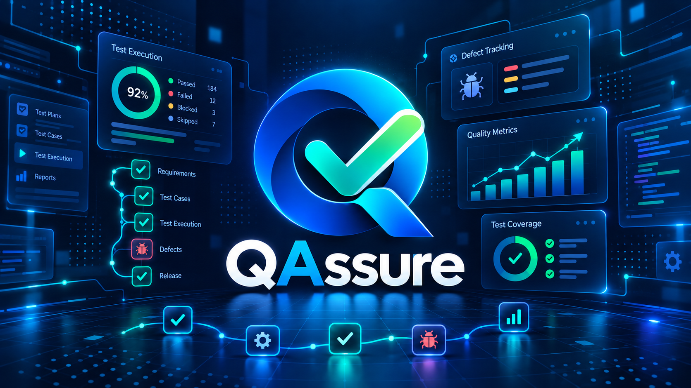

<div align="center">



**Software Quality Assurance Platform**

*Verify. Validate. Assure.*


<br/><br/>

<a href="https://github.com/Jairo0811/QAssure/actions/workflows/ci.yml">
  
</a>

</div>

---

## 📌 Descripción

**QAssure** es una plataforma de aseguramiento de calidad de software creada para **Verificación y Validación de Software (ISO-410)** en la **Universidad APEC (UNAPEC)**.

Centraliza el ciclo completo de QA en un solo flujo: requisitos, análisis de riesgos, diseño y ejecución de pruebas, defectos, re-test, regresión, trazabilidad, métricas de calidad, quality gates y evidencia de validación final.

La aplicación presenta actualmente un **centro de control QA moderno**, con dashboard principal, navegación por módulos, indicadores de calidad y una experiencia visual unificada. La interfaz está **completamente en español**, mientras los contratos internos de la API permanecen estables.

```text
Proyecto
   ↓
Requisito → Riesgo → Caso de prueba → Ciclo de prueba → Ejecución
                                                  ↓
                                               Defecto
                                                  ↓
                                               Re-test
                                                  ↓
Trazabilidad → Reporte de calidad → Validación final → Gate de liberación
```

---

## 🎓 Información académica

| Información | Detalle |
|---|---|
| 🏫 Institución | **Universidad APEC (UNAPEC)** |
| 📖 Asignatura | **Verificación y Validación de Software (ISO-410)** |
| 👨‍🏫 Profesor | **Luis Nuñez Acosta** |
| 📅 Período académico | **Enero - Abril 2025** |
| 📁 Proyecto | **QAssure** |

### 👥 Equipo académico original

| 👤 Integrante | 🆔 Matrícula UNAPEC |
|---|---|
| 👨🏻‍💻 **Albert Mateo Tejada** | **A00107388** |
| 👨🏻‍💻 **Francisco Daniel Lora Gonzalez** | **A00114255** |
| 👨🏻‍💻 **Francis Jairo Matias Rosario** | **A00115261** |

---

## 🧭 Continuidad académica

### 🎓 Puente interinstitucional ITLA → UNAPEC

Los tres integrantes del equipo tienen trayectoria académica documentada tanto en **ITLA** como en **UNAPEC**.

| Integrante | Matrícula ITLA | Matrícula UNAPEC |
|---|---:|---:|
| Albert Mateo Tejada | **2018-6302** | **A00107388** |
| Francisco Daniel Lora Gonzalez | **2019-7800** | **A00114255** |
| Francis Jairo Matias Rosario | **2015-2984** | **A00115261** |

Esta tabla documenta únicamente la continuidad institucional de cada integrante. **No implica que hayan cursado las mismas asignaturas ni que hayan coincidido académicamente entre sí en ITLA.**

---

## 🧱 Stack tecnológico

### ⚙️ Backend / API

<p>
  
  
  
  
</p>

- .NET 10 / ASP.NET Core Web API;
- C#;
- Entity Framework Core 10;
- Clean Architecture;
- JWT Bearer;
- autorización basada en roles;
- OpenAPI.

### 🎨 Frontend

<p>
  
</p>

- React 19;
- TypeScript 5.9;
- Vite 7;
- SPA conectada a la API;
- dashboard tipo **QA command center**;
- interfaz completamente en español;
- módulos visuales para proyectos, requisitos, riesgos, casos, ejecuciones, defectos, trazabilidad, reportes y validación final.

### 🗄️ Datos e infraestructura local

<p>
  
  
</p>

- SQL Server 2022;
- Entity Framework Core SQL Server provider;
- Docker Compose para el entorno local;
- volumen persistente para la base de datos.

### 🧪 QA, testing y CI

<p>
  
  
</p>

- xUnit para pruebas automatizadas del backend;
- GitHub Actions para restore, build y tests .NET;
- GitHub Actions para instalación y build del frontend;
- evidencia de validación final para seguridad, rendimiento, usabilidad y UAT;
- quality gate calculado a partir de evidencia real del proyecto.

> Herramientas como Playwright, Postman/Newman o k6 no se presentan como implementadas mientras no formen parte versionada del repositorio.

---

## ✅ Estado actual — Foundation + fases 1–7 completas

QAssure se encuentra en estado **1.0 Release Candidate**. La plataforma implementa el ciclo funcional completo previsto para la entrega académica.

| Fase | Alcance | Estado |
|---:|---|:---:|
| 0 | Foundation: arquitectura, CI, SQL Server, health check y OpenAPI | ✅ |
| 1 | Autenticación, roles, proyectos y requisitos | ✅ |
| 2 | Análisis de riesgos y diseño de casos de prueba | ✅ |
| 3 | Ciclos de prueba y evidencia de ejecución | ✅ |
| 4 | Defectos, re-test y ciclo de regresión | ✅ |
| 5 | Matriz de trazabilidad y cobertura | ✅ |
| 6 | Reportes de calidad, métricas y quality gates | ✅ |
| 7 | Evidencia de seguridad, rendimiento, usabilidad y UAT | ✅ |

El sistema **no fabrica estados verdes**. Un proyecto puede permanecer `Conditional` o `Blocked` hasta que la evidencia registrada satisfaga realmente las condiciones del gate.

---

## 🖥️ Centro de control QA

La experiencia web actual organiza QAssure como un centro de control operativo:

- dashboard principal con contexto del proyecto seleccionado;
- acceso directo a Proyectos QA, Requisitos, Riesgos y Casos de prueba;
- Ciclos de prueba y Ejecuciones;
- gestión de Defectos y re-pruebas;
- Matriz de trazabilidad;
- Reporte de calidad y puertas de liberación;
- Validación final;
- navegación y mensajes completamente localizados al español.

---

## 🧪 Quality gate

Un proyecto alcanza `Ready` cuando cumple simultáneamente:

- cobertura de requisitos ≥ **95%**;
- pass rate ≥ **90%**;
- al menos **1** Test Run completado;
- **0** ejecuciones pendientes en ciclos activos;
- **0** defectos críticos abiertos;
- **0** riesgos críticos abiertos;
- **4/4** áreas finales de validación con evidencia `Passed`.

Si las condiciones no se cumplen, QAssure devuelve `Conditional` o `Blocked` según la severidad de los incumplimientos.

---

## 🔄 Flujo funcional de QA

```text
1. Crear proyecto QA
        ↓
2. Registrar requisitos y criterios de aceptación
        ↓
3. Identificar y evaluar riesgos
        ↓
4. Diseñar casos de prueba
        ↓
5. Crear Test Runs
        ↓
6. Ejecutar pruebas y registrar evidencia
        ↓
7. Crear defectos cuando corresponda
        ↓
8. Corregir → Re-test → Regresión
        ↓
9. Revisar matriz de trazabilidad y cobertura
        ↓
10. Generar reporte de calidad
        ↓
11. Registrar evidencia final de validación
        ↓
12. Evaluar gate de liberación
```

---

## 🏗️ Arquitectura

```text
React 19 + TypeScript + Vite
            │
            │ HTTP / JSON
            ▼
      QAssure.Api
     ASP.NET Core 10
            │
            ▼
      Application
            │
            ▼
         Domain
            ▲
            │
     Infrastructure
      EF Core 10
            │
            ▼
     SQL Server 2022
```

La solución mantiene separación por capas mediante **Clean Architecture**, evitando que el dominio dependa directamente de infraestructura, persistencia o interfaz web.

---

## 🚀 Desarrollo local

### 1. SQL Server

```bash
docker compose up -d
```

El contenedor expone SQL Server por el puerto local `14333`.

### 2. Backend

```bash
cd backend/src/QAssure.Api
dotnet run
```

### 3. Frontend

```bash
cd frontend/qassure-web
npm install
npm run dev
```

La URL base predeterminada de la API para el frontend es:

```text
http://localhost:5000
```

### Credenciales locales

```text
Email:    admin@qassure.local
Password: QAssure.Local123!
```

Estas credenciales son exclusivamente para desarrollo local.

> **Base de datos académica:** el bootstrap actual utiliza `EnsureCreated`. Si se actualiza desde una fase anterior, puede ser necesario recrear una vez la base local para incorporar las tablas nuevas. Una evolución productiva debería reemplazar este mecanismo por EF Core Migrations.

---

## 🧪 Calidad y CI

El workflow `.github/workflows/ci.yml` ejecuta dos jobs independientes:

### Backend

- `dotnet restore`;
- `dotnet build` en Release;
- `dotnet test` en Release.

### Frontend

- Node.js 22;
- instalación de dependencias;
- TypeScript type-check mediante el script de build;
- build de Vite.

---

## 📚 Evidencia y documentación por fase

- [`docs/PHASE-1.md`](docs/PHASE-1.md)
- [`docs/PHASE-2.md`](docs/PHASE-2.md)
- [`docs/PHASE-3.md`](docs/PHASE-3.md)
- [`docs/PHASE-4.md`](docs/PHASE-4.md)
- [`docs/PHASE-5.md`](docs/PHASE-5.md)
- [`docs/PHASE-6.md`](docs/PHASE-6.md)
- [`docs/PHASE-7.md`](docs/PHASE-7.md)
- [`docs/FINAL-VALIDATION-CHECKLIST.md`](docs/FINAL-VALIDATION-CHECKLIST.md)
- [`docs/RELEASE-1.0.md`](docs/RELEASE-1.0.md)

---

## 🧠 Filosofía QA

QAssure está diseñado para que el propio sistema pueda verificarse y validarse utilizando las mismas prácticas que administra: análisis de requisitos, técnicas de diseño de pruebas, evaluación de riesgos, ejecución, defect management, re-test, regresión, trazabilidad, métricas, seguridad, rendimiento, usabilidad y aceptación de usuario.

---

<div align="center">

**QAssure · ISO-410 · UNAPEC · 1.0 Release Candidate**

</div>
